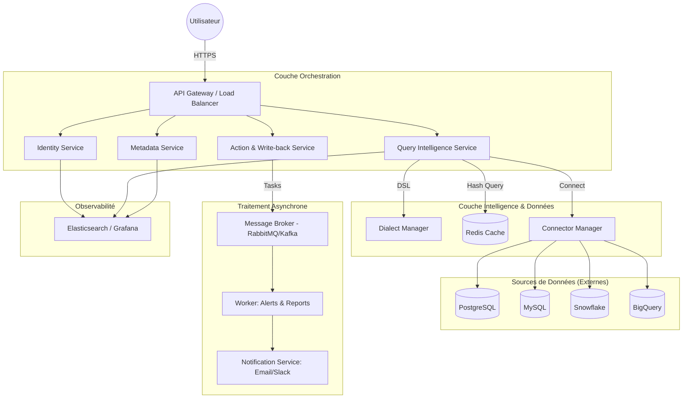

# 🏗️ Architecture Microservices Scalable : BI-Plateforme (Prism Hub)

Cette architecture est conçue pour supporter une charge massive (milliers d'utilisateurs simultanés) et une extensibilité infinie.

## 1. Schéma de l'Architecture

## 2. Rôles des Microservices

### 🛡️ Identity Service (Auth)
*   **Responsabilité** : Gérer les identités, les JWT et surtout les **Security Attributes** (Région, Département, etc.).
*   **Scalabilité** : Peut être répliqué. Utilise un cache pour les sessions actives.

### 🧠 Metadata Service (Semantic Layer)
*   **Responsabilité** : Le gardien de la "Vérité Métier". Il stocke les définitions des métriques, dimensions et les tags `@scope` pour le RLS.
*   **Persistance** : Base relationnelle (Postgres) dédiée aux métadonnées.

### ⚡ Query Intelligence Service (Le Cœur)
*   **Responsabilité** : Traduire le DSL en SQL, injecter le RLS, compiler via Jinja2.
*   **Scalabilité Horizontale** : C'est le service le plus sollicité. Il est **Stateless** (sans état), donc on peut en lancer 10, 100 ou 1000 instances en fonction de la charge.

### 📝 Action & Write-back Service
*   **Responsabilité** : Gérer les formulaires de saisie et les écritures sécurisées. Il envoie les tâches lourdes (ex: export CSV de 1Go) au Message Broker.

## 3. Stratégies de Scalabilité

1.  **Horizontal Scaling (K8s)** : Chaque microservice est containerisé (Docker) et orchestré par Kubernetes. Si la CPU d'un service dépasse 70%, une nouvelle instance démarre automatiquement.
2.  **Query Hashing & Caching** : Les résultats des requêtes sont stockés dans **Redis**. Une requête identique ne touche jamais la base de données source deux fois.
3.  **Read Replicas** : Le Metadata Service utilise des replicas en lecture pour ne jamais ralentir l'interface lors de grosses vagues de connexions.
4.  **Isolation des Connecteurs** : Le Connector Manager isole les pools de connexions pour qu'une base de données lente (ex: un vieux serveur local) n'impacte pas les performances des autres datasets.

## 4. Flux de Communication
*   **Synchrones (REST/gRPC)** : Pour les demandes immédiates (affichage d'un graphique).
*   **Asynchrones (Kafka/RabbitMQ)** : Pour tout ce qui prend du temps (Alertes, rapports planifiés, imports de données).

---
*Cette architecture garantit que BI-Plateforme reste rapide, sûre et facile à maintenir même avec une croissance exponentielle.*
